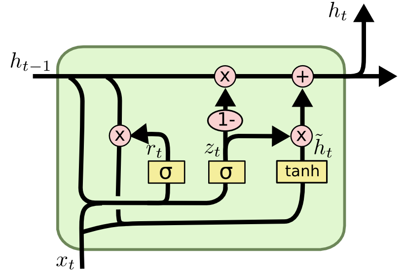

---
---

# Data Science Principles Project: Quora Insincere questions classification

### Introduction

This is a final project done for EE 461P: Data Science Principles at the University of Texas at Austin. This project was completed by Andy Chang, Clive Unger, Nick Edelman, Nic Key, and Avishka Suduwa Dewage.

We chose to do this problem from Kaggle:
[kaggle.com/c/quora-insincere-questions-classification](kaggle.com/c/quora-insincere-questions-classification)

Quora.com is a platform where people can ask questions and connect with others who contribute unique insights and quality answers.

A key challenge is to weed out insincere questions, founded upon false premises, or intending to make a statement rather than look for helpful answers.

In this competition, Kagglers will develop models that identify and flag insincere questions.

***
***

### The Data
The **training data** is 1.31m rows of data, it looks like this.

| qid | question_text | target |
| -| -| -|
| 00002165364db923c7e6 | How did Quebec nationalists see their province as a nation in the 1960s? | 0 |
| … | … | … |
| cd7642554d107f946d8a | What is the full form of DML? | 0 |

The **test data** is 56.4k rows of data, it obviously does not have the target labels, it looks like this.

| qid | question_text |
| -| -|
| 00014894849d00ba98a9 | My voice range is A2-C5. My chest voice goes up to F4. Included sample in my higher chest range. What is my voice type?|
| … | … |
| fffed08be2626f74b139 | Why do all the stupid people I know tend to be left-wing?|

***

The rules by which the training data was scored is as follows:
* Has a non-neutral tone
* Is disparaging or inflammatory
* Isn’t grounded in reality
* Uses sexual content for shock value

Several sets of **word embeddings** were also provided:
* Google word2vec embeddings from Google News
* “GloVe” word embeddings from Wikipedia
* PPDB Paragram word Embeddings
* fastText trained word embeddings from Wikinews

***
***
### Evaluation

#### Submissions are scored on F1 Score

***
***

### Exploratory Data Analysis

##### Imbalanced Target:
We first looked at the distribution of the target variable. The number of insincere questions is much less than the sincere, with only 6% of the training set being insincere.

***

##### Word Clouds:
Next we looked at a word cloud of the each class to get a feel for the data. As you can see the insincere question has much more controversial words.

***

***
##### 2-gram frequency:
It is hard to get much detail from a word cloud, so we look a the word frequencies of respective classes.

| Most Insincere 2 grams | Word Count | Most Sincere 2 grams | Word Count |
|----------------------|------------|------------------------|------------|
| donald trump         | 1253       | best way               | 6973       |
| white people         | 673        | year old               | 2972       |
| black people         | 653        | will happen            | 2084       |
| many people          | 383        | many people            | 1931       |
| united states        | 360        | computer science       | 1870       |
| even though          | 335        | even though            | 1859       |
| trump supporters     | 335        | known for?             | 1822       |
| year old             | 330        | united states          | 1797       |
| president trump      | 328        | long take              | 1796       |
| hillary clinton      | 305        | high school            | 1775       |
| people think         | 297        | best ways              | 1447       |
| chinese people       | 255        | social media           | 1435       |
| indian muslims       | 225        | donald trump           | 1417       |
| indian girls         | 221        | look like?             | 1327       |
| people hate          | 217        | much time              | 1287       |
| north indians        | 204        | much money             | 1176       |
| people quora         | 186        | best place             | 1162       |
| indian women         | 184        | people think           | 1143       |
| white women          | 168        | united states?         | 1126       |

***
##### Logistic Regression Coefficients:
Next we ran a basic Logistic Regression model so that we could examine the weights of individual words and how they influence the target variable. The words that influence are extremely offensive.

| Most insincere words	 |  Coefficient 	   |Most sincere words     | Coefficient |
|------------------------|---------------------|-----------------------|---------------------|
| castrated              | 20.612              |books                  | -5.422              |
| castrate               | 18.014              |men women              | -5.606              |
| liberals               | 17.248              |differences            | -5.671              |
| democrats              | 17.019              |affect                 | -5.688              |
| muslims                | 16.91               |christians muslims     | -5.912              |
| indians                | 15.34               |black hole             | -5.929              |
| trump                  | 14.543              |liberals conservatives | -5.978              |
| americans              | 14.329              |tips                   | -5.992              |
| blacks                 | 14.226              |best                   | -6.358              |
| women                  | 14.122              |democrats republicans  | -6.594              |

***
We also looked at the most negative weighted words, suggesting words that are most found in sincere questions. 
What is interesting here is that in sincere questions there is mentions of both sides of opposing ideas, such as "liberals conservatives" or "black white". 
This possibly suggests that more sincere questions consider both sides of argument rather than imposing stereotypes on one.

***
***
### Data Preprocessing
We had to do a lot of data cleaning to get better performance out of the models. Our cleaning method were motivated by increasing coverage of word embeddings.

With no preprocessing only 32.77% of all vocabulary in the question corpus was covered. Only 88.14% of all the text was covered by the embedding.

Our cleaning process proceeded as follows:
1. Expand contractions out to two words
2. Remove non-printable characters.
3. Replace special characters with words. For example '∞': 'infinity'
4. Replace numbers with # symbol.
5. Change European spellings to American and correct other common misspellings
6. “Facebook”,  “Instagram” , etc.  convert to “Social medium”
6. Remove stopwords and one character words.

After all of this cleaning we improved the word embedding coverage to cover 75% of the vocab and **99.595%** of the text.

***
***
### Modeling

#### Model 1: Simple Recurrent Neural Network
The first model we experimented with is a simple RNN implementation in Keras. This RNN utilizes a bidirectional GRU as its recurrent unit (from other kernels, using a bidirectional LSTM as the recurrent unit didn’t seem to perform as well).

***

The entire model architecture is shown below:

~~~~
| Layer (type)                  | Output Shape     | Param #  |
|-------------------------------|------------------|----------|
| input_1 (InputLayer)          | (None, 100)      | 0        |
| embedding_1 (Embedding)       | (None, 100, 300) | 15000000 |
| bidirectional_1 (Bidirection  | (None, 100, 128) | 140544   |
| global_max_pooling1d_1 (Glob) | (None, 128)      | 0        |
| dense_1 (Dense)               | (None, 16)       | 2064     |
| dropout_1 (Dropout)           | (None, 16)       | 0        |
| dense_2 (Dense)               | (None, 1)        | 17       |
|-------------------------------|------------------|----------|

Total params: 15,142,625

Trainable params: 15,142,625

Non-trainable params: 0
~~~~

***

For both inference and training, each input question/sentence is first cleaned, tokenized, and padded into a sequence of length 100. This is fed into the model’s first layer, the embedding layer. As previously stated, we experimented with different pre-trained embeddings (such as word2vec, GloVe etc.) and learned embeddings (from provided training data) for this layer. This RNN implementation was used for further experimentation with different embedding options.

***
***

Next, a simple bidirectional GRU layer is used for temporal reasoning (a more detailed diagram of a GRU is shown below). The rest of the network is filled out with the usual suspects: fully connected, max pooling, and dropout layers.

This model performs reasonably well considering its simplicity. The top score achieved using this model is 0.67; an ensemble of RNNs using GloVe, FastText, and Paragram embeddings as the weights for the embedding layer is used to attain this score.

<iframe width="100%" height="300" src="//jsfiddle.net/avishkas/f3wmypv9/embedded/result/dark/" allowfullscreen="allowfullscreen" allowpaymentrequest frameborder="0"></iframe>
